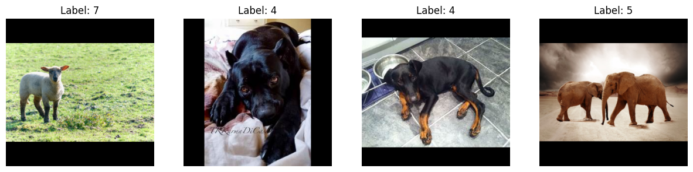
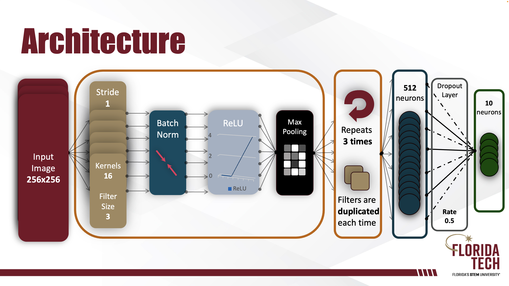
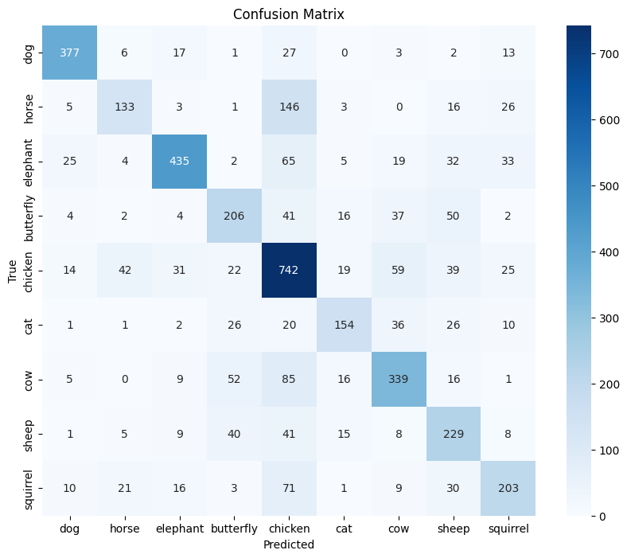
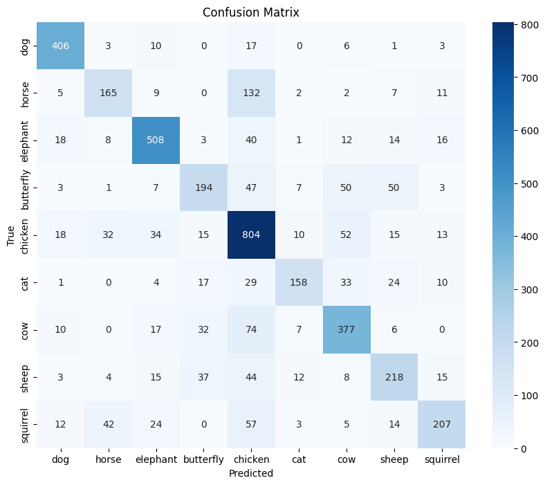
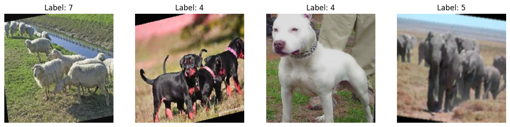
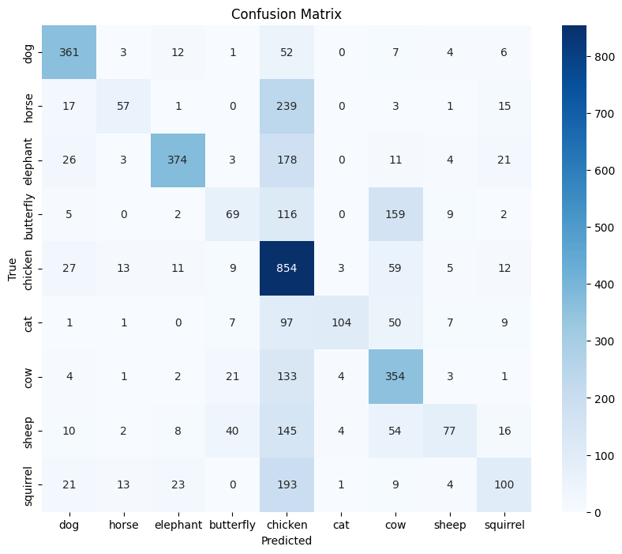
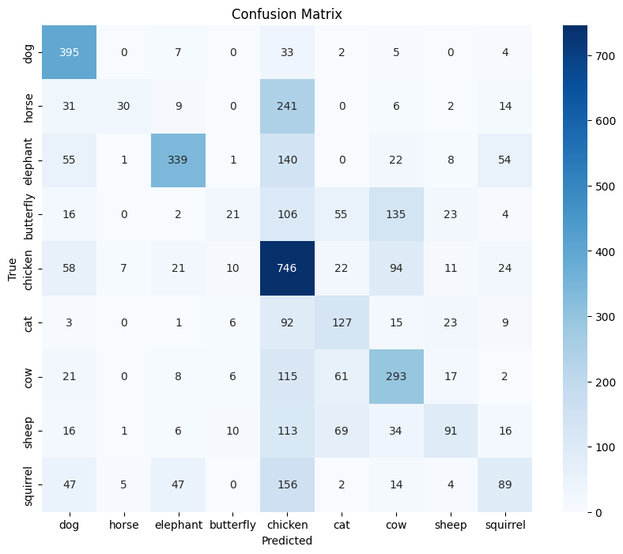
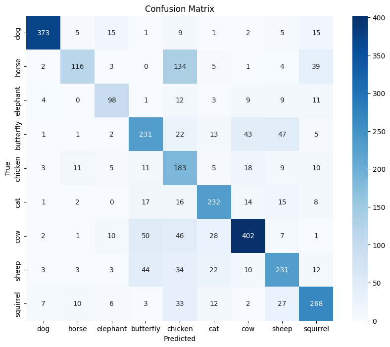
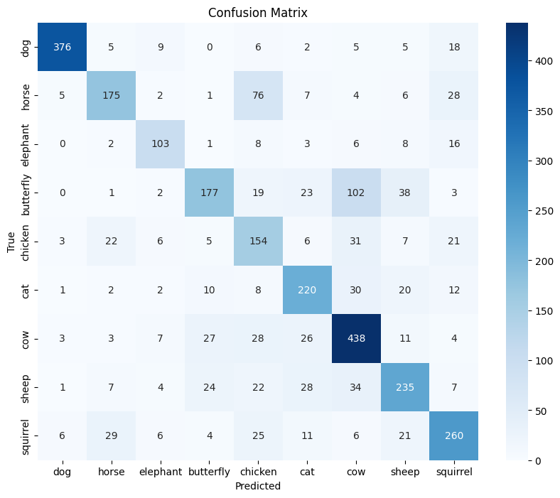

# Introduction/Abstract

The objective of this endeavor is to classify photographs of animals utilizing a Convolutional Neural Network. This will be accomplished through the training of the neural network on the [Animals-10](https://www.kaggle.com/datasets/alessiocorrado99/animals10/data) dataset, which comprises 28,000 images depicting dogs, cats, horses, spiders, butterflies, chickens, sheep, cows, squirrels, and elephants of “medium size.” The biggest find was importance of proper data preprocessing more specifcally knowing the data you are working with to identify skews, data normalization can give you free accuracy, and how image tranformations are applied can drastically change your runtime.

## Related Works/Methods/Results

So the paper is written by showcasing any related works at the beginning of the method, the method itself, and a discussion of the results.

# Batch Size

The main focus is to get the highest batch size that our GPU RAM will allow because we can get a more accurate gradient estimate with a bigger batch size. Landed on **450** since it consumed 30gb of our GPU RAM (out of 40), which leaves space in the future.


```python
import os # Modern day coding were we throw libaries and hopefully it works
import torch
import time
import random
import kagglehub
import warnings
import numpy as np
from PIL import Image
import seaborn as sns
import torch.nn as nn
import torch.optim as optim
import torch.nn.init as init
import matplotlib.pyplot as plt
import torch.nn.functional as F
from sklearn.metrics import confusion_matrix
from torchvision import datasets, transforms
from torchvision.transforms import functional as TF
from torch.utils.data import DataLoader, Dataset, Subset, random_split, ConcatDataset

batch_size = 450
images_size = 224

# Ensure reproducibility, by having the same see .
seed = 42
torch.manual_seed(seed)
random.seed(seed)
np.random.seed(seed)
if torch.cuda.is_available():
    torch.cuda.manual_seed(seed)
    torch.cuda.manual_seed_all(seed)
    torch.backends.cudnn.deterministic = True
    torch.backends.cudnn.benchmark = False

# Download the Animals10 dataset
path = kagglehub.dataset_download("alessiocorrado99/animals10")
print("Path to dataset files:", path)
```

    Path to dataset files: /root/.cache/kagglehub/datasets/alessiocorrado99/animals10/versions/2


# Getting STD and Mean For Data Normalization


```python
data_loader = DataLoader(full_data, batch_size=64, shuffle=False)

def calculate_mean_std(loader):
    mean = 0.0
    std = 0.0
    for images, _ in loader:
        batch_samples = images.size(0)
        images = images.view(batch_samples, images.size(1), -1)
        mean += images.mean(2).sum(0)
        std += images.std(2).sum(0)
    mean /= len(loader.dataset)
    std /= len(loader.dataset)
    return mean, std

mean, std = calculate_mean_std(data_loader)
print(f"Mean: {mean}")
print(f"Standard Deviation: {std}")
```

    Mean: tensor([0.3753, 0.3637, 0.3024])
    Standard Deviation: tensor([0.2902, 0.2850, 0.2611])


Perfect now we can properly normalize our data its time to preprocess!

## Data Preprocessing Part 1

The resolutions between the images are different. Papers like Yolov6 (1) apparently resize to 640x640. Older models like AlexNet (2) use 240x240. I initially tried 320x320, but it ended up maxing out our GPU RAM. I settled for 224 so we can have faster training time. Another reason is that we are not trying to identify species of animals, hence we don’t need that much detail. Second problem: normally we have a labels file, but this time the labels are the folder where the images are stored. Third, the labels are in Italian, so we need to translate them. Fourth, each image has a different resolution, so we are going to resize it in a way to maintain the aspect ratio but still be consistent with the rest of the images. Furthermore, we need to get the mean and std deviation so we can properly normalize all the data so it helps the model converge (find its minimum). Below you’re going to see commented code on how the data was preprocessed. The code was also optimized to run the transformations once to help with runtime. In addition, you're going to see the 60/20/20 split done by creating a custom data set function, doing the split, and then applying the tranformation. This way we can ensure when we get to data augmentation it is only applied to the train set.


```python
#Will resize the image with padding
def resize_with_padding(image, target_size=images_size):

    #Resizes the images
    w, h = image.size
    scale = target_size / max(w, h)
    new_w, new_h = int(w * scale), int(h * scale)
    resized_image = TF.resize(image, (new_h, new_w))

    # Calculates padding
    padding_left = (target_size - new_w) // 2
    padding_top = (target_size - new_h) // 2
    padding_right = target_size - new_w - padding_left
    padding_bottom = target_size - new_h - padding_top

    # Applies padding
    padded_image = TF.pad(resized_image, (padding_left, padding_top, padding_right, padding_bottom), fill=0)
    return padded_image

# Augmentations for training data
transform_aug = transforms.Compose([
    transforms.Lambda(lambda img: img.convert("RGB")),
    transforms.RandomHorizontalFlip(p=0.5),         # 50% chance to apply
    transforms.RandomRotation(degrees=15),          # Randomly rotate by +/- 15 degrees
    transforms.RandomResizedCrop(size=(images_size, images_size), scale=(0.8, 1.0)),
    transforms.ColorJitter(brightness=0.2, contrast=0.2, saturation=0.2, hue=0.1),
    transforms.RandomApply([transforms.GaussianBlur(kernel_size=5)], p=0.5),  # 50% chance to apply
    transforms.Lambda(lambda img: resize_with_padding(img, target_size=images_size)),
    transforms.ToTensor(),  # Convert the image to a tensor
    transforms.Normalize(mean=[0.3753, 0.3637, 0.3024], std=[0.2902, 0.2850, 0.2611])
])

# Transformations for validation and test data
transform_with_padding = transforms.Compose([
    transforms.Lambda(lambda img: img.convert("RGB")),
    transforms.Lambda(lambda img: resize_with_padding(img, target_size=images_size)),
    transforms.ToTensor(),
    transforms.Normalize(mean=[0.3753, 0.3637, 0.3024], std=[0.2902, 0.2850, 0.2611])
])

translate = {
    "cane": "dog", "cavallo": "horse", "elefante": "elephant",
    "farfalla": "butterfly", "gallina": "chicken", "gatto": "cat",
    "mucca": "cow", "pecora": "sheep", "scoiattolo": "squirrel"
}

# Custom dataset class to handle the Animals10 dataset with translation
class Animals10Dataset(Dataset):
    def __init__(self, root_dir, transform=None, translate=None):
        self.root_dir = root_dir
        self.transform = transform
        self.translate = translate
        # Creates a list with the english names
        self.classes = sorted([translate[cls] for cls in os.listdir(root_dir) if cls in translate])

        # Will add indices to the list so we can iterate later.
        self.class_to_idx = {cls_name: idx for idx, cls_name in enumerate(self.classes)}
        self.images = []
        self.labels = []

        #This collects the paths of images and stores them
        #Also collects the labels and stores them
        for class_name, label in self.class_to_idx.items():
            class_path = os.path.join(root_dir, next(k for k, v in translate.items() if v == class_name))
            for img_name in os.listdir(class_path):
                self.images.append(os.path.join(class_path, img_name))
                self.labels.append(label)

    def __len__(self):
        return len(self.images)

    def __getitem__(self, idx):
        img_path = self.images[idx]
        image = Image.open(img_path)
        label = self.labels[idx]

        if self.transform:
            image = self.transform(image)

        return image, label

# Custom dataset class for caching data
class transformdataset(Dataset):
    def __init__(self, subset, transform=None):
        self.subset = subset
        self.transform = transform
        self.images = [self.subset.dataset.images[idx] for idx in self.subset.indices]
        self.labels = [self.subset.dataset.labels[idx] for idx in self.subset.indices]

    def __len__(self):
        return len(self.labels)

    def __getitem__(self, idx):
        img_path = self.images[idx]
        image = Image.open(img_path)
        label = self.labels[idx]

        if self.transform:
            image = self.transform(image)

        return image, label

# Path to the dataset and cache directories
root_dir = os.path.join(path, 'raw-img')  # Update with the actual path

# Load the full dataset
full_data = Animals10Dataset(root_dir,translate = translate)

# Split the dataset
train_size = int(0.6 * len(full_data))
val_size = int(0.2 * len(full_data))
test_size = len(full_data) - train_size - val_size

train_data, val_data, test_data = random_split(full_data, [train_size, val_size, test_size])

# Augment the training data
train_data_transformed = transformdataset(train_data, transform=transform_with_padding)

# Transform validation and test data
val_data_transformed = transformdataset(val_data, transform=transform_with_padding)
test_data_transformed = transformdataset(test_data, transform=transform_with_padding)

# Create DataLoaders for training, validation, and test data
train_loader = DataLoader(train_data_transformed, batch_size=batch_size, shuffle=True, num_workers=4, pin_memory=True)
val_loader = DataLoader(val_data_transformed, batch_size=batch_size, shuffle=False, num_workers=4, pin_memory=True)
test_loader = DataLoader(test_data_transformed, batch_size=batch_size, shuffle=False, num_workers=4, pin_memory=True)
```

# Check images


```python
import matplotlib.pyplot as plt
import numpy as np
import torch

# Ensure inline plotting in Colab
%matplotlib inline

def unnormalize(image, mean, std):
    """Unnormalizes the image using the provided mean and std."""
    image = image.numpy().transpose((1, 2, 0))  # Transpose from (C, H, W) to (H, W, C)
    mean = np.array(mean)
    std = np.array(std)
    image = std * image + mean  # Unnormalize
    image = np.clip(image, 0, 1)
    return image

def show_image(image, title="Image"):
    image = unnormalize(image, mean=[0.3753, 0.3637, 0.3024], std=[0.2902, 0.2850, 0.2611])
    plt.imshow(image)
    plt.title(title)
    plt.axis('off')  # Hide axis
    plt.show()

data_iter = iter(train_loader)
images, labels = next(data_iter)

# Show a few images
fig, axes = plt.subplots(1, 4, figsize=(15, 5))
for idx, ax in enumerate(axes):
    image = unnormalize(images[idx], mean=[0.3753, 0.3637, 0.3024], std=[0.2902, 0.2850, 0.2611])
    ax.imshow(image)
    ax.set_title(f"Label: {labels[idx].item()}")
    ax.axis('off')  # Hide axis
plt.show()
```


    

    


Perfect, data augmentation will be discussed later.

## Attempt at Data Caching

So the idea here is to perform the image augmentations and save them on the disk, instead of transforming the images on the fly, potentially speeding up train time. Ultimately, it just took too long to process, likely because it was not using a GPU, and then converting to a tensor and back did not work as well with my series of transformations, so **we did not end up using it.** Ultimately, it did teach me to be more careful about how to apply transformations and custom data sets, which made me write more optimized code.

# Cross Entropy / Adam

[Cross entropy](https://www.youtube.com/watch?v=KHVR587oW8I) was chosen as the loss function because is widely used to classification tasks because it compares two probability distributions. pi  is the probability of state i in distribution P and qi is the probability of state i in distribution Q.

$$
H(P, Q) = -\sum_{i} p_i \log(q_i)
$$


Also after some reasearch ADAM seems to be the go to for this type of problem and its designed in a way for it to work best at its default learning rate. They worked well

# Initial Achitecture *


VGG (3), ResNet (4), and DenseNet (5), (which are classification models) use a pyramid-like structure, so we are going to implement something similar. To delve deeper into how this works, think about a convolution. It’s essentially summing the kernel area from the input matrix (matrix 1) into an element of the output matrix (matrix 2). So if we take the convolution of that matrix 2, suddenly each element of matrix 2 is technically representing the elements that were masked from matrix 1. All this to say, the deeper you go into a network, each element will represent more and more from the previous layers. Hence, the deeper we go into a network, it can capture more broad features, and the earlier parts of the network will capture smaller features. This would allow the network to identify more complex patterns since it has the knowledge of the finer and broad details.

Now that we have that understanding of receptive fields, we can delve deeper into the decisions that were made in our network. Let’s start with the CNN. We start small with n filters, but we gradually increase to n times 2 filters. Each layer just keeps multiplying n times 2 until we reach 8. This structure is meant to grab the simpler features like edges at the initial layers of the network and more complex features like shapes towards the last layers of the network. At the end, we have a dropout layer to help reduce overfitting. These are typically placed at the end to reduce too much dependence on broad features. We are using ReLU vs. leaky to reduce the number of hyperparameters so we can tune the model more effectively. Batch normalization is between each layer to help the model converge faster. Lastly, we have a max pooling layer to help extract the most important features (max pooling works like a convolution, but instead of multiplying and summing to make one element in a new matrix, it just grabs the highest value from the current position of the kernel). To decide the initial amount of filter (n), I experimented with different initial filter amounts. We started with 64 and 32, but it maxed out our GPU RAM in our A100. So we ended up with 16 as the initial filter amount.




```python
filters = 16
neurons = 512
dropout_rate = 0.5

class SimpleCNN(nn.Module):
    def __init__(self):
        super(SimpleCNN, self).__init__()
        self.conv1 = nn.Conv2d(3, filters, kernel_size=3, padding=1)
        self.bn1 = nn.BatchNorm2d(filters)
        self.relu = nn.ReLU()
        self.pool = nn.MaxPool2d(kernel_size=2, stride=2)

        self.conv2 = nn.Conv2d(filters, filters*2, kernel_size=3, padding=1)
        self.bn2 = nn.BatchNorm2d(filters*2)

        self.conv3 = nn.Conv2d(filters*2, filters*4, kernel_size=3, padding=1)
        self.bn3 = nn.BatchNorm2d(filters*4)

        self.conv4 = nn.Conv2d(filters*4, filters*8, kernel_size=3, padding=1)
        self.bn4 = nn.BatchNorm2d(filters*8)

        self.fc1 = nn.Linear(filters * 8 * (int(images_size/filters)**2), neurons)
        self.dropout1 = nn.Dropout(p=dropout_rate)
        self.fc2 = nn.Linear(neurons, 10)  # Assuming 10 classes

    def forward(self, x):
        x = self.pool(self.relu(self.bn1(self.conv1(x))))
        x = self.pool(self.relu(self.bn2(self.conv2(x))))
        x = self.pool(self.relu(self.bn3(self.conv3(x))))
        x = self.pool(self.relu(self.bn4(self.conv4(x))))
        x = x.view(-1, filters * 8 * (int(images_size/filters)**2))
        x = self.dropout1(F.relu(self.fc1(x)))
        x = self.fc2(x)
        return x

# Model instantiation
device = torch.device("mps" if torch.backends.mps.is_available() else "cuda" if torch.cuda.is_available() else "cpu")
net = SimpleCNN().to(device)

print(device)  # Check which device you're using
```

    cuda


```python
pip install torchmetrics
```

    Requirement already satisfied: torchmetrics in /usr/local/lib/python3.10/dist-packages (1.6.0)
    Requirement already satisfied: numpy>1.20.0 in /usr/local/lib/python3.10/dist-packages (from torchmetrics) (1.26.4)
    Requirement already satisfied: packaging>17.1 in /usr/local/lib/python3.10/dist-packages (from torchmetrics) (24.2)
    Requirement already satisfied: torch>=2.0.0 in /usr/local/lib/python3.10/dist-packages (from torchmetrics) (2.5.1+cu121)
    Requirement already satisfied: lightning-utilities>=0.8.0 in /usr/local/lib/python3.10/dist-packages (from torchmetrics) (0.11.9)
    Requirement already satisfied: setuptools in /usr/local/lib/python3.10/dist-packages (from lightning-utilities>=0.8.0->torchmetrics) (75.1.0)
    Requirement already satisfied: typing-extensions in /usr/local/lib/python3.10/dist-packages (from lightning-utilities>=0.8.0->torchmetrics) (4.12.2)
    Requirement already satisfied: filelock in /usr/local/lib/python3.10/dist-packages (from torch>=2.0.0->torchmetrics) (3.16.1)
    Requirement already satisfied: networkx in /usr/local/lib/python3.10/dist-packages (from torch>=2.0.0->torchmetrics) (3.4.2)
    Requirement already satisfied: jinja2 in /usr/local/lib/python3.10/dist-packages (from torch>=2.0.0->torchmetrics) (3.1.4)
    Requirement already satisfied: fsspec in /usr/local/lib/python3.10/dist-packages (from torch>=2.0.0->torchmetrics) (2024.10.0)
    Requirement already satisfied: sympy==1.13.1 in /usr/local/lib/python3.10/dist-packages (from torch>=2.0.0->torchmetrics) (1.13.1)
    Requirement already satisfied: mpmath<1.4,>=1.1.0 in /usr/local/lib/python3.10/dist-packages (from sympy==1.13.1->torch>=2.0.0->torchmetrics) (1.3.0)
    Requirement already satisfied: MarkupSafe>=2.0 in /usr/local/lib/python3.10/dist-packages (from jinja2->torch>=2.0.0->torchmetrics) (3.0.2)


Use of checkpoints in case we crash.


```python
from torchmetrics.classification import MulticlassPrecision, MulticlassRecall, MulticlassF1Score
def save_checkpoint(model, optimizer, epoch, path='checkpoint.pth'):
    state = {
        'epoch': epoch,
        'model_state_dict': model.state_dict(),
        'optimizer_state_dict': optimizer.state_dict(),
    }
    torch.save(state, path)

# Load checkpoint function
def load_checkpoint(model, optimizer, path='checkpoint.pth'):
    checkpoint = torch.load(path)
    model.load_state_dict(checkpoint['model_state_dict'])
    optimizer.load_state_dict(checkpoint['optimizer_state_dict'])
    epoch = checkpoint['epoch']
    return model, optimizer, epoch

def load_checkpoint_test(model, path='checkpoint.pth'):
    checkpoint = torch.load(path)
    model.load_state_dict(checkpoint['model_state_dict'])
    return model
```

# Benchmark Model *


```python
learning_rate = 0.001
num_epochs = 100
best_val_acc = 0
best_epoch = 0
patience = 10
patience_counter = 0

criterion = nn.CrossEntropyLoss()
optimizer = optim.Adam(net.parameters(), lr=learning_rate)
```


```python
print(f"{'Epoch':<10}{'Train Acc':<15}{'Train Loss':<15}{'Val Acc':<15}{'Val Loss':<15}")
start_time = time.time()
for epoch in range(num_epochs):
    net.train()
    correct = 0
    total = 0
    running_loss = 0.0
    for inputs, labels in train_loader:
        inputs, labels = inputs.to(device), labels.to(device)
        optimizer.zero_grad()
        outputs = net(inputs)
        loss = criterion(outputs, labels)
        loss.backward()
        optimizer.step()

        running_loss += loss.item()
        _, predicted = torch.max(outputs.data, 1)
        total += labels.size(0)
        correct += (predicted == labels).sum().item()

    train_accuracy = correct / total * 100
    train_loss = running_loss / len(train_loader)

    net.eval()
    correct = 0
    total = 0
    val_loss = 0
    with torch.no_grad():
        for inputs, labels in val_loader:
            inputs, labels = inputs.to(device), labels.to(device)
            outputs = net(inputs)
            loss = criterion(outputs, labels)
            val_loss += loss.item()
            _, predicted = torch.max(outputs.data, 1)
            total += labels.size(0)
            correct += (predicted == labels).sum().item()

    val_acc = correct / total * 100
    val_loss /= len(val_loader)
    print(f"{epoch+1:<10}{train_accuracy:<15.2f}{train_loss:<15.4f}{val_acc:<15.2f}{val_loss:<15.4f}")

    # Check for early stopping and save best model
    if val_acc > best_val_acc:
        best_val_acc = val_acc
        best_epoch = epoch
        patience_counter = 0
        torch.save(net.state_dict(), 'best_model.pth')
        # Save checkpoint at the end of each epoch
        save_checkpoint(net, optimizer, epoch, path='checkpoint.pth')
    else:
        patience_counter += 1
        if patience_counter >= patience:
            print(f'Early stopping at epoch {epoch+1}')
            break


end_time = time.time()
print(f'Best validation accuracy was {best_val_acc:.4f} at epoch {best_epoch+1}')
print(f'Training runtime: {((end_time - start_time)/60):.2f} minutes')
warnings.resetwarnings()
```

    Epoch     Train Acc      Train Loss     Val Acc        Val Loss       
    1         18.99          11.0134        27.56          2.1057         
    2         24.72          2.0728         32.19          1.9353         
    3         28.95          1.9680         33.41          1.8524         
    4         31.70          1.8951         36.53          1.7892         
    5         33.61          1.8376         39.08          1.7391         
    6         35.20          1.7993         40.11          1.7027         
    7         36.09          1.7604         40.72          1.6659         
    8         37.15          1.7287         41.63          1.6085         
    9         39.44          1.6836         42.52          1.5733         
    10        40.31          1.6438         45.14          1.5632         
    11        41.21          1.6144         44.95          1.5106         
    12        42.67          1.5689         48.58          1.4792         
    13        44.17          1.5379         49.99          1.4147         
    14        45.01          1.5017         50.74          1.4165         
    15        46.54          1.4693         52.94          1.3871         
    16        47.23          1.4262         51.81          1.3625         
    17        48.45          1.4073         53.62          1.3468         
    18        49.47          1.3743         54.18          1.3097         
    19        50.28          1.3510         56.57          1.2905         
    20        51.64          1.3117         56.75          1.2663         
    21        52.41          1.2866         57.32          1.2348         
    22        52.89          1.2753         54.81          1.3705         
    23        54.25          1.2440         57.29          1.2212         
    24        55.81          1.2127         58.89          1.2111         
    25        56.25          1.1762         61.16          1.1656         
    26        56.88          1.1525         60.03          1.1920         
    27        58.25          1.1230         61.09          1.1920         
    28        59.32          1.0876         60.29          1.1949         
    29        59.60          1.0814         61.48          1.1394         
    30        60.31          1.0620         62.35          1.1497         
    31        61.39          1.0254         61.30          1.2000         
    32        62.44          0.9994         61.70          1.1409         
    33        62.55          0.9859         62.66          1.1408         
    34        63.61          0.9608         62.07          1.2004         
    35        65.10          0.9227         63.33          1.1439         
    36        65.05          0.9123         62.14          1.1358         
    37        65.48          0.9036         63.26          1.2683         
    38        66.60          0.8733         64.43          1.1538         
    39        67.53          0.8480         62.44          1.2718         
    40        67.67          0.8364         64.76          1.1304         
    41        68.21          0.8281         63.83          1.1716         
    42        69.27          0.8028         63.12          1.2836         
    43        69.20          0.7962         64.53          1.2250         
    44        70.24          0.7782         65.35          1.1807         
    45        71.23          0.7355         65.75          1.1830         
    46        72.16          0.7105         63.87          1.3290         
    47        72.11          0.7111         66.28          1.2354         
    48        72.13          0.7048         66.21          1.1616         
    49        73.33          0.6690         65.91          1.2080         
    50        71.84          0.7032         63.52          1.3080         
    51        73.07          0.6734         65.32          1.2309         
    52        73.72          0.6626         65.79          1.2232         
    53        74.40          0.6559         65.37          1.3857         
    54        76.23          0.6084         64.79          1.2564         
    55        75.42          0.6285         65.89          1.2513         
    56        76.04          0.6032         67.01          1.2396         
    57        76.32          0.5907         66.64          1.2403         
    58        77.60          0.5600         65.68          1.5475         
    59        77.43          0.5706         66.52          1.4325         
    60        77.67          0.5656         67.41          1.3495         
    61        78.30          0.5439         66.89          1.4726         
    62        77.37          0.5582         66.28          1.3748         
    63        78.77          0.5288         66.10          1.4489         
    64        79.48          0.5149         66.87          1.4615         
    65        80.04          0.5078         66.40          1.2918         
    66        78.11          0.5309         66.38          1.4636         
    67        78.60          0.5284         66.38          1.4632         
    68        78.11          0.5338         66.89          1.4317         
    69        79.64          0.5185         67.71          1.4026         
    70        80.12          0.4962         64.48          1.6479         
    71        78.88          0.5099         67.10          1.3984         
    72        79.83          0.5043         66.07          1.5685         
    73        80.01          0.4887         67.71          1.5269         
    74        80.72          0.4790         66.00          1.6230         
    75        80.10          0.4945         66.68          1.6543         
    76        80.34          0.4842         66.89          1.8109         
    77        79.94          0.4946         66.75          1.4748         
    78        81.23          0.4632         67.53          1.4859         
    79        81.75          0.4566         66.14          1.6723         
    Early stopping at epoch 79
    Best validation accuracy was 67.7125 at epoch 69
    Training runtime: 34.33 minutes


```python
# Load the saved checkpoint
net = load_checkpoint(net, path='/content/checkpoint.pth')
print('Checkpoint loaded successfully')

# Set the network to evaluation mode
net.eval()

# Initialize variables for tracking performance
correct = 0
total = 0
test_loss = 0
all_labels = []
all_predictions = []

# Initialize metrics
num_classes = 10  # Update this with the number of classes in your dataset
precision = MulticlassPrecision(num_classes=num_classes, average='macro').to(device)
recall = MulticlassRecall(num_classes=num_classes, average='macro').to(device)
f1_score = MulticlassF1Score(num_classes=num_classes, average='macro').to(device)

with torch.no_grad():
    for inputs, labels in test_loader:
        inputs = inputs.to(device)
        labels = labels.to(device)
        outputs = net(inputs)
        loss = criterion(outputs, labels)
        test_loss += loss.item() * inputs.size(0)

        _, predicted = torch.max(outputs, 1)
        correct += (predicted == labels).sum().item()
        total += labels.size(0)

        # Update metrics
        all_labels.extend(labels.cpu().numpy())
        all_predictions.extend(predicted.cpu().numpy())
        precision.update(predicted, labels)
        recall.update(predicted, labels)
        f1_score.update(predicted, labels)

# Calculate average test loss and accuracy
avg_loss = test_loss / total
accuracy = 100 * correct / total
val_precision = precision.compute()
val_recall = recall.compute()
val_f1 = f1_score.compute()

# Compute confusion matrix
cm = confusion_matrix(all_labels, all_predictions)

# Plot confusion matrix
plt.figure(figsize=(10, 8))
sns.heatmap(cm, annot=True, fmt='d', cmap='Blues', xticklabels=translate.values(), yticklabels=translate.values())
plt.xlabel('Predicted')
plt.ylabel('True')
plt.title('Confusion Matrix')
plt.show()

print(f'Test Loss: {avg_loss:.4f}, Test Accuracy: {accuracy:.2f}%')
print(f'Test Precision: {val_precision:.4f}')
print(f'Test Recall: {val_recall:.4f}')
print(f'Test F1 Score: {val_f1:.4f}')

# Reset the metrics
precision.reset()
recall.reset()
f1_score.reset()

```

    <ipython-input-4-85adf04187ff>:11: FutureWarning: You are using `torch.load` with `weights_only=False` (the current default value), which uses the default pickle module implicitly. It is possible to construct malicious pickle data which will execute arbitrary code during unpickling (See https://github.com/pytorch/pytorch/blob/main/SECURITY.md#untrusted-models for more details). In a future release, the default value for `weights_only` will be flipped to `True`. This limits the functions that could be executed during unpickling. Arbitrary objects will no longer be allowed to be loaded via this mode unless they are explicitly allowlisted by the user via `torch.serialization.add_safe_globals`. We recommend you start setting `weights_only=True` for any use case where you don't have full control of the loaded file. Please open an issue on GitHub for any issues related to this experimental feature.
      checkpoint = torch.load(path)


    Checkpoint loaded successfully


    

    


    Test Loss: 1.4127, Test Accuracy: 65.95%
    Test Precision: 0.6638
    Test Recall: 0.6300
    Test F1 Score: 0.6411


Figure 1: Benchmark Test Loss, precision, recall, F1 score and confusion matrix.

Good base to start from lets start with Learning Scheduler.

# Learning Scheduler *


So my idea on using a scheduler is to decrease the number of epochs and achieve similar accuracy. For this, I want to increase the learning rate at the beginning and lower it towards the end to stabilize the learning. The OneCycleLR achieves this, so let’s try that one!


```python
from torch.optim.lr_scheduler import OneCycleLR

learning_rate = 0.001
num_epochs = 100
best_val_acc = 0
best_epoch = 0
patience = 10
patience_counter = 0

criterion = nn.CrossEntropyLoss()
optimizer = optim.Adam(net.parameters(), lr=learning_rate)

# Use OneCycleLR
scheduler = OneCycleLR(optimizer, max_lr=0.01, steps_per_epoch=len(train_loader), epochs=num_epochs)

warnings.filterwarnings("ignore", category=FutureWarning)

# Load checkpoint if it exists
try:
    net, optimizer, start_epoch = load_checkpoint(net, optimizer, path='checkpoint.pth')
except FileNotFoundError:
    start_epoch = 0

print(f"{'Epoch':<10}{'Train Acc':<15}{'Train Loss':<15}{'Val Acc':<15}{'Val Loss':<15}")
start_time = time.time()
for epoch in range(start_epoch, num_epochs):
    net.train()
    correct = 0
    total = 0
    running_loss = 0.0
    for inputs, labels in train_loader:
        inputs, labels = inputs.to(device), labels.to(device)
        optimizer.zero_grad()
        outputs = net(inputs)
        loss = criterion(outputs, labels)
        loss.backward()
        optimizer.step()

        running_loss += loss.item()
        _, predicted = torch.max(outputs.data, 1)
        total += labels.size(0)
        correct += (predicted == labels).sum().item()

        # Step the scheduler after each batch
        scheduler.step()

    train_accuracy = correct / total * 100
    train_loss = running_loss / len(train_loader)

    net.eval()
    correct = 0
    total = 0
    val_loss = 0
    with torch.no_grad():
        for inputs, labels in val_loader:
            inputs, labels = inputs.to(device), labels.to(device)
            outputs = net(inputs)
            loss = criterion(outputs, labels)
            val_loss += loss.item()
            _, predicted = torch.max(outputs.data, 1)
            total += labels.size(0)
            correct += (predicted == labels).sum().item()

    val_acc = correct / total * 100
    val_loss /= len(val_loader)
    print(f"{epoch+1:<10}{train_accuracy:<15.2f}{train_loss:<15.4f}{val_acc:<15.2f}{val_loss:<15.4f}")

    # Check for early stopping and save best model
    if val_acc > best_val_acc:
        best_val_acc = val_acc
        best_epoch = epoch
        patience_counter = 0
        torch.save(net.state_dict(), 'best_model.pth')
        # Save checkpoint at the end of each epoch
        save_checkpoint(net, optimizer, epoch, path='checkpoint.pth')
    else:
        patience_counter += 1
        if patience_counter >= patience:
            print(f'Early stopping at epoch {epoch+1}')
            break


end_time = time.time()
print(f'Best validation accuracy was {best_val_acc:.4f} at epoch {best_epoch+1}')
print(f'Training runtime: {((end_time - start_time)/60):.2f} minutes')
warnings.resetwarnings()
```

    Epoch     Train Acc      Train Loss     Val Acc        Val Loss       
    1         17.06          6.0705         30.48          2.1487         
    2         23.09          2.1190         30.84          1.9756         
    3         26.42          2.0090         35.12          1.8641         
    4         29.92          1.9120         36.36          1.7693         
    5         32.52          1.8390         38.59          1.7190         
    6         34.94          1.7844         41.21          1.6459         
    7         38.07          1.7267         46.20          1.5446         
    8         40.53          1.6469         46.24          1.5318         
    9         41.93          1.6107         46.20          1.5447         
    10        42.52          1.5768         47.37          1.4954         
    11        44.67          1.5157         45.61          1.6374         
    12        45.76          1.5035         49.40          1.4886         
    13        46.21          1.4828         51.60          1.4112         
    14        46.57          1.4740         49.40          1.4866         
    15        47.92          1.4435         55.68          1.3120         
    16        47.72          1.4536         52.84          1.3935         
    17        46.18          1.5006         51.04          1.4168         
    18        44.89          1.5188         52.63          1.3649         
    19        48.13          1.4383         53.36          1.3351         
    20        48.04          1.4540         55.40          1.3180         
    21        47.84          1.4503         52.17          1.5118         
    22        48.59          1.4241         51.58          1.5726         
    23        49.35          1.3870         57.64          1.2343         
    24        52.22          1.3228         56.52          1.2736         
    25        53.32          1.2850         55.44          1.3589         
    26        54.11          1.2471         59.49          1.2554         
    27        55.35          1.1855         62.09          1.1670         
    28        54.77          1.2393         59.66          1.2374         
    29        57.42          1.1215         60.83          1.1525         
    30        60.39          1.0410         63.76          1.1540         
    31        60.92          1.0157         62.87          1.1256         
    32        62.17          0.9693         62.37          1.2007         
    33        63.27          0.9405         65.04          1.0985         
    34        64.91          0.8881         64.46          1.1776         
    35        65.87          0.8640         65.49          1.1198         
    36        66.43          0.8565         64.29          1.1065         
    37        67.89          0.8032         66.31          1.1870         
    38        70.15          0.7633         67.34          1.1015         
    39        71.18          0.7275         67.17          1.1124         
    40        71.56          0.7119         66.57          1.1427         
    41        73.09          0.6862         68.04          1.1819         
    42        74.04          0.6615         66.07          1.1671         
    43        73.03          0.6786         65.32          1.1788         
    44        75.33          0.6291         66.73          1.3147         
    45        75.15          0.6153         66.68          1.3734         
    46        75.34          0.6071         68.23          1.1674         
    47        77.36          0.5745         68.41          1.2628         
    48        77.65          0.5508         67.34          1.2053         
    49        78.41          0.5328         68.49          1.3368         
    50        78.22          0.5300         69.61          1.2672         
    51        79.00          0.5137         68.70          1.3282         
    52        79.27          0.5116         68.46          1.2787         
    53        80.11          0.4835         66.66          1.3319         
    54        80.21          0.4950         67.48          1.3329         
    55        80.26          0.4833         67.99          1.3065         
    56        80.30          0.4866         68.74          1.3119         
    57        81.72          0.4548         67.76          1.3586         
    58        81.85          0.4334         69.68          1.3686         
    59        82.06          0.4325         68.34          1.4459         
    60        82.05          0.4331         69.14          1.3885         
    61        82.66          0.4195         68.70          1.6144         
    62        82.50          0.4214         69.52          1.5215         
    63        84.04          0.3887         69.26          1.4955         
    64        83.42          0.4036         69.77          1.4833         
    65        83.85          0.3836         69.19          1.6222         
    66        84.52          0.3788         69.16          1.5644         
    67        84.59          0.3745         69.52          1.5352         
    68        84.56          0.3713         70.29          1.4658         
    69        85.66          0.3524         70.03          1.5645         
    70        85.45          0.3493         69.80          1.5567         
    71        85.55          0.3560         70.36          1.6771         
    72        85.86          0.3426         70.73          1.6830         
    73        85.79          0.3429         70.66          1.6050         
    74        85.77          0.3395         70.76          1.6036         
    75        85.66          0.3371         70.38          1.5906         
    76        86.12          0.3346         70.92          1.7614         
    77        85.97          0.3317         71.08          1.6736         
    78        86.78          0.3171         70.17          1.9725         
    79        87.16          0.3144         70.92          1.7433         
    80        86.66          0.3200         70.97          1.7897         
    81        86.55          0.3203         70.36          1.7974         
    82        87.06          0.3141         70.99          1.7909         
    83        87.53          0.3046         70.19          1.8968         
    84        87.66          0.2993         70.59          1.8986         
    85        87.72          0.2945         70.99          1.9174         
    86        86.95          0.3016         70.66          1.8757         
    87        87.42          0.2988         71.25          1.9205         
    88        88.14          0.2916         71.11          1.9411         
    89        87.47          0.3004         70.83          1.9440         
    90        88.34          0.2807         71.34          1.9557         
    91        87.99          0.2884         71.18          1.9576         
    92        88.28          0.2870         71.13          2.0224         
    93        87.93          0.2919         71.22          1.9688         
    94        87.58          0.2941         71.20          1.9707         
    95        87.93          0.2910         71.39          1.9940         
    96        87.94          0.2846         71.29          1.9812         
    97        88.00          0.2864         71.08          2.0161         
    98        87.74          0.2913         71.11          1.9985         
    99        87.96          0.2865         71.11          2.0023         
    100       88.35          0.2752         71.15          2.0060         
    Best validation accuracy was 71.3884 at epoch 95
    Training runtime: 44.43 minutes


```python
# Load the saved checkpoint
net = load_checkpoint(net, path='/content/checkpoint.pth')
print('Checkpoint loaded successfully')

# Set the network to evaluation mode
net.eval()

# Initialize variables for tracking performance
correct = 0
total = 0
test_loss = 0
all_labels = []
all_predictions = []

# Initialize metrics
num_classes = 10  # Update this with the number of classes in your dataset
precision = MulticlassPrecision(num_classes=num_classes, average='macro').to(device)
recall = MulticlassRecall(num_classes=num_classes, average='macro').to(device)
f1_score = MulticlassF1Score(num_classes=num_classes, average='macro').to(device)

with torch.no_grad():
    for inputs, labels in test_loader:
        inputs = inputs.to(device)
        labels = labels.to(device)
        outputs = net(inputs)
        loss = criterion(outputs, labels)
        test_loss += loss.item() * inputs.size(0)

        _, predicted = torch.max(outputs, 1)
        correct += (predicted == labels).sum().item()
        total += labels.size(0)

        # Update metrics
        all_labels.extend(labels.cpu().numpy())
        all_predictions.extend(predicted.cpu().numpy())
        precision.update(predicted, labels)
        recall.update(predicted, labels)
        f1_score.update(predicted, labels)

# Calculate average test loss and accuracy
avg_loss = test_loss / total
accuracy = 100 * correct / total
val_precision = precision.compute()
val_recall = recall.compute()
val_f1 = f1_score.compute()

# Compute confusion matrix
cm = confusion_matrix(all_labels, all_predictions)

# Plot confusion matrix
plt.figure(figsize=(10, 8))
sns.heatmap(cm, annot=True, fmt='d', cmap='Blues', xticklabels=translate.values(), yticklabels=translate.values())
plt.xlabel('Predicted')
plt.ylabel('True')
plt.title('Confusion Matrix')
plt.show()

print(f'Test Loss: {avg_loss:.4f}, Test Accuracy: {accuracy:.2f}%')
print(f'Test Precision: {val_precision:.4f}')
print(f'Test Recall: {val_recall:.4f}')
print(f'Test F1 Score: {val_f1:.4f}')

# Reset the metrics
precision.reset()
recall.reset()
f1_score.reset()

```

    Checkpoint loaded successfully


    

    


    Test Loss: 2.1087, Test Accuracy: 71.07%
    Test Precision: 0.7175
    Test Recall: 0.6717
    Test F1 Score: 0.6884


Figure 2: OneCycleLR Test Loss, Precision, Recal, and F1 Score.

So if we do some math, figure 1 took 2.3 min per epoch vs figure 2 which took 2.25 min per epoch. So we did get a slight improvement! I did forget to set the patience to 5 for figure 1 and 2 which wasted compute units. Also the confusion matrix shows we have a class wise performance variation by having a strong bias on classifying chicken properly. This might be because the data itself might have more pictures of chickens. So we are going to try some data augmentation because we also have an overfitting issue as seen in the train accuracy vs validation accuracy in later epochs.

# Data Augmentation with scheduler *

So the idea here is to change the images in some way to help the model prepare for unseen data (val and test). For this experiment, we only change the train data set. We want to make sure we don’t augment our val and test set. Each augmented image will have augmentation **randomly** applied, so each picture has a different combination of augmentations. I also updated the preprocessing code to fix some bugs hence why its here.


```python
import matplotlib.pyplot as plt

# Ensure inline plotting in Colab
%matplotlib inline

def unnormalize(image, mean, std):
    """Unnormalizes the image using the provided mean and std."""
    image = image.numpy().transpose((1, 2, 0))  # Transpose from (C, H, W) to (H, W, C)
    mean = np.array(mean)
    std = np.array(std)
    image = std * image + mean  # Unnormalize
    image = np.clip(image, 0, 1)
    return image

def show_image(image, title="Image"):
    image = unnormalize(image, mean=[0.3753, 0.3637, 0.3024], std=[0.2902, 0.2850, 0.2611])
    plt.imshow(image)
    plt.title(title)
    plt.axis('off')  # Hide axis
    plt.show()

data_iter = iter(train_loader)
images, labels = next(data_iter)

# Show a few images
fig, axes = plt.subplots(1, 4, figsize=(15, 5))
for idx, ax in enumerate(axes):
    image = unnormalize(images[idx], mean=[0.3753, 0.3637, 0.3024], std=[0.2902, 0.2850, 0.2611])
    ax.imshow(image)
    ax.set_title(f"Label: {labels[idx].item()}")
    ax.axis('off')  # Hide axis
plt.show()
```


    

    


```python
from torch.optim.lr_scheduler import OneCycleLR

learning_rate = 0.001
num_epochs = 50
best_val_acc = 0
best_epoch = 0
patience = 5
patience_counter = 0

criterion = nn.CrossEntropyLoss()
optimizer = optim.Adam(net.parameters(), lr=learning_rate)
scheduler = OneCycleLR(optimizer, max_lr=0.01, steps_per_epoch=len(train_loader), epochs=num_epochs)
```


```python
warnings.filterwarnings("ignore", category=FutureWarning)

# Load checkpoint if it exists
try:
    net, optimizer, start_epoch = load_checkpoint(net, optimizer,'checkpoint.pth')
except FileNotFoundError:
    start_epoch = 0

print(f"{'Epoch':<10}{'Train Acc':<15}{'Train Loss':<15}{'Val Acc':<15}{'Val Loss':<15}")
start_time = time.time()
for epoch in range(start_epoch, num_epochs):
    net.train()
    correct = 0
    total = 0
    running_loss = 0.0
    for inputs, labels in train_loader:
        inputs, labels = inputs.to(device), labels.to(device)
        optimizer.zero_grad()
        outputs = net(inputs)
        loss = criterion(outputs, labels)
        loss.backward()
        optimizer.step()

        running_loss += loss.item()
        _, predicted = torch.max(outputs.data, 1)
        total += labels.size(0)
        correct += (predicted == labels).sum().item()

        # Step the scheduler after each batch
        scheduler.step()

    train_accuracy = correct / total * 100
    train_loss = running_loss / len(train_loader)

    net.eval()
    correct = 0
    total = 0
    val_loss = 0
    with torch.no_grad():
        for inputs, labels in val_loader:
            inputs, labels = inputs.to(device), labels.to(device)
            outputs = net(inputs)
            loss = criterion(outputs, labels)
            val_loss += loss.item()
            _, predicted = torch.max(outputs.data, 1)
            total += labels.size(0)
            correct += (predicted == labels).sum().item()

    val_acc = correct / total * 100
    val_loss /= len(val_loader)
    print(f"{epoch+1:<10}{train_accuracy:<15.2f}{train_loss:<15.4f}{val_acc:<15.2f}{val_loss:<15.4f}")

    # Check for early stopping and save best model
    if val_acc > best_val_acc:
        best_val_acc = val_acc
        best_epoch = epoch
        patience_counter = 0
        torch.save(net.state_dict(), 'best_model.pth')
        # Save checkpoint at the end of each epoch
        save_checkpoint(net, optimizer, epoch, path='checkpoint.pth')
    else:
        patience_counter += 1
        if patience_counter >= patience:
            print(f'Early stopping at epoch {epoch+1}')
            break


end_time = time.time()
print(f'Best validation accuracy was {best_val_acc:.4f} at epoch {best_epoch+1}')
print(f'Training runtime: {((end_time - start_time)/60):.2f} minutes')
warnings.resetwarnings()
```

    Epoch     Train Acc      Train Loss     Val Acc        Val Loss       
    1         18.16          3.9581         26.48          2.0940         
    2         22.51          2.1006         28.10          2.0004         
    3         27.95          1.9976         30.81          1.9041         
    4         29.18          1.9363         31.42          1.8990         
    5         30.43          1.8998         31.59          1.8722         
    6         31.61          1.8772         30.77          1.8900         
    7         32.17          1.8536         35.94          1.7645         
    8         33.62          1.8201         27.63          1.9871         
    9         35.30          1.7944         23.13          2.2143         
    10        35.10          1.7943         25.71          2.5174         
    11        34.51          1.8182         33.65          1.9105         
    12        33.88          1.8160         38.77          1.7027         
    13        34.28          1.8079         20.04          2.4196         
    14        34.98          1.7983         40.65          1.6484         
    15        37.17          1.7300         36.85          1.7818         
    16        39.66          1.6931         38.89          1.7469         
    17        39.46          1.6699         41.49          1.6420         
    18        41.56          1.6265         32.97          1.8306         
    19        42.29          1.5984         42.59          1.5505         
    20        44.04          1.5437         45.75          1.4868         
    21        46.26          1.5134         49.80          1.4146         
    22        46.71          1.4736         43.53          1.6621         
    23        47.83          1.4515         51.96          1.3632         
    24        48.41          1.4304         40.86          1.7689         
    25        49.66          1.3982         54.09          1.3226         
    26        51.67          1.3489         54.46          1.2974         
    27        51.74          1.3417         46.31          1.5395         
    28        53.04          1.2922         53.95          1.3519         
    29        52.89          1.2942         52.92          1.3857         
    30        53.82          1.2817         52.05          1.3824         
    31        54.79          1.2418         49.75          1.4667         
    Early stopping at epoch 31
    Best validation accuracy was 54.4603 at epoch 26
    Training runtime: 25.14 minutes


```python
# Load the saved checkpoint
net = load_checkpoint_test(net, path='/content/checkpoint.pth')
print('Checkpoint loaded successfully')

# Set the network to evaluation mode
net.eval()

# Initialize variables for tracking performance
correct = 0
total = 0
test_loss = 0
all_labels = []
all_predictions = []

# Initialize metrics
num_classes = 10  # Update this with the number of classes in your dataset
precision = MulticlassPrecision(num_classes=num_classes, average='macro').to(device)
recall = MulticlassRecall(num_classes=num_classes, average='macro').to(device)
f1_score = MulticlassF1Score(num_classes=num_classes, average='macro').to(device)

with torch.no_grad():
    for inputs, labels in test_loader:
        inputs = inputs.to(device)
        labels = labels.to(device)
        outputs = net(inputs)
        loss = criterion(outputs, labels)
        test_loss += loss.item() * inputs.size(0)

        _, predicted = torch.max(outputs, 1)
        correct += (predicted == labels).sum().item()
        total += labels.size(0)

        # Update metrics
        all_labels.extend(labels.cpu().numpy())
        all_predictions.extend(predicted.cpu().numpy())
        precision.update(predicted, labels)
        recall.update(predicted, labels)
        f1_score.update(predicted, labels)

# Calculate average test loss and accuracy
avg_loss = test_loss / total
accuracy = 100 * correct / total
val_precision = precision.compute()
val_recall = recall.compute()
val_f1 = f1_score.compute()

# Compute confusion matrix
cm = confusion_matrix(all_labels, all_predictions)

# Plot confusion matrix
plt.figure(figsize=(10, 8))
sns.heatmap(cm, annot=True, fmt='d', cmap='Blues', xticklabels=translate.values(), yticklabels=translate.values())
plt.xlabel('Predicted')
plt.ylabel('True')
plt.title('Confusion Matrix')
plt.show()

print(f'Test Loss: {avg_loss:.4f}, Test Accuracy: {accuracy:.2f}%')
print(f'Test Precision: {val_precision:.4f}')
print(f'Test Recall: {val_recall:.4f}')
print(f'Test F1 Score: {val_f1:.4f}')

# Reset the metrics
precision.reset()
recall.reset()
f1_score.reset()

```

    Checkpoint loaded successfully


    <ipython-input-8-59577c662f3d>:19: FutureWarning: You are using `torch.load` with `weights_only=False` (the current default value), which uses the default pickle module implicitly. It is possible to construct malicious pickle data which will execute arbitrary code during unpickling (See https://github.com/pytorch/pytorch/blob/main/SECURITY.md#untrusted-models for more details). In a future release, the default value for `weights_only` will be flipped to `True`. This limits the functions that could be executed during unpickling. Arbitrary objects will no longer be allowed to be loaded via this mode unless they are explicitly allowlisted by the user via `torch.serialization.add_safe_globals`. We recommend you start setting `weights_only=True` for any use case where you don't have full control of the loaded file. Please open an issue on GitHub for any issues related to this experimental feature.
      checkpoint = torch.load(path)


    

    


    Test Loss: 1.2756, Test Accuracy: 55.00%
    Test Precision: 0.6389
    Test Recall: 0.4643
    Test F1 Score: 0.4893


Figure 3: Data augmentation with scheduler of all the training samples

We changed our patience value, leading to lower epochs. We did get our lowest
test accuracy yet. Our overfitting issue seems to be worse. The model with a learning scheduler at around epoch 40 had train and validation accuracy almost the same, while in this one, train was around 5% higher. We did see some oscillation in the training data, so let’s try to stabilize the learning with a constant learning rate.

# Data Augmentation without scheduler *

Data augmentation with scheduler saw some oscillations in the val accuracy, so having a constant learning rate in this experiment is an attempt to stabalize it.


```python
warnings.filterwarnings("ignore", category=FutureWarning)

# Load checkpoint if it exists
try:
    net, optimizer, start_epoch = load_checkpoint(net, optimizer,'checkpoint.pth')
except FileNotFoundError:
    start_epoch = 0

print(f"{'Epoch':<10}{'Train Acc':<15}{'Train Loss':<15}{'Val Acc':<15}{'Val Loss':<15}")
start_time = time.time()
for epoch in range(start_epoch, num_epochs):
    net.train()
    correct = 0
    total = 0
    running_loss = 0.0
    for inputs, labels in train_loader:
        inputs, labels = inputs.to(device), labels.to(device)
        optimizer.zero_grad()
        outputs = net(inputs)
        loss = criterion(outputs, labels)
        loss.backward()
        optimizer.step()

        running_loss += loss.item()
        _, predicted = torch.max(outputs.data, 1)
        total += labels.size(0)
        correct += (predicted == labels).sum().item()

    train_accuracy = correct / total * 100
    train_loss = running_loss / len(train_loader)

    net.eval()
    correct = 0
    total = 0
    val_loss = 0
    with torch.no_grad():
        for inputs, labels in val_loader:
            inputs, labels = inputs.to(device), labels.to(device)
            outputs = net(inputs)
            loss = criterion(outputs, labels)
            val_loss += loss.item()
            _, predicted = torch.max(outputs.data, 1)
            total += labels.size(0)
            correct += (predicted == labels).sum().item()

    val_acc = correct / total * 100
    val_loss /= len(val_loader)
    print(f"{epoch+1:<10}{train_accuracy:<15.2f}{train_loss:<15.4f}{val_acc:<15.2f}{val_loss:<15.4f}")

    # Check for early stopping and save best model
    if val_acc > best_val_acc:
        best_val_acc = val_acc
        best_epoch = epoch
        patience_counter = 0
        torch.save(net.state_dict(), 'best_model.pth')
        # Save checkpoint at the end of each epoch
        save_checkpoint(net, optimizer, epoch, path='checkpoint.pth')
    else:
        patience_counter += 1
        if patience_counter >= patience:
            print(f'Early stopping at epoch {epoch+1}')
            break


end_time = time.time()
print(f'Best validation accuracy was {best_val_acc:.4f} at epoch {best_epoch+1}')
print(f'Training runtime: {((end_time - start_time)/60):.2f} minutes')
warnings.resetwarnings()
```

    Epoch     Train Acc      Train Loss     Val Acc        Val Loss       
    1         19.89          6.0888         27.51          2.0970         
    2         24.74          2.1006         28.31          1.9857         
    3         26.81          2.0196         29.41          1.9780         
    4         27.21          2.0084         29.48          1.9710         
    5         27.68          1.9797         28.59          1.9946         
    6         28.66          1.9665         30.74          1.9433         
    7         29.12          1.9542         32.64          1.8639         
    8         29.74          1.9186         32.57          1.8581         
    9         30.40          1.9020         33.90          1.8422         
    10        30.54          1.8943         32.15          1.8604         
    11        31.31          1.8756         35.68          1.7970         
    12        32.35          1.8547         32.99          1.8410         
    13        33.04          1.8294         36.67          1.7484         
    14        33.82          1.8207         35.47          1.7880         
    15        34.69          1.8005         33.83          1.8018         
    16        35.39          1.7608         37.91          1.7034         
    17        36.59          1.7403         34.77          1.8119         
    18        36.98          1.7200         36.17          1.7323         
    19        37.31          1.6905         39.45          1.6734         
    20        38.48          1.6805         38.52          1.7225         
    21        38.16          1.6909         38.84          1.6707         
    22        39.29          1.6559         40.20          1.6612         
    23        38.83          1.6558         39.05          1.6893         
    24        39.88          1.6365         41.56          1.6377         
    25        40.72          1.6099         40.11          1.7764         
    26        40.52          1.6173         41.96          1.6650         
    27        41.25          1.5966         43.32          1.6532         
    28        40.25          1.5962         41.65          1.6054         
    29        41.03          1.5823         39.69          1.7249         
    30        42.30          1.5647         41.47          1.6730         
    31        42.55          1.5678         45.49          1.5720         
    32        42.77          1.5401         48.58          1.4794         
    33        42.52          1.5500         47.04          1.4930         
    34        42.88          1.5291         48.58          1.4528         
    35        43.32          1.5245         45.42          1.5616         
    36        43.92          1.5100         47.27          1.5206         
    37        44.12          1.5104         41.70          1.6148         
    Early stopping at epoch 37
    Best validation accuracy was 48.5835 at epoch 32
    Training runtime: 29.56 minutes


```python
# Load the saved checkpoint
net = load_checkpoint_test(net, path='/content/checkpoint.pth')
print('Checkpoint loaded successfully')

# Set the network to evaluation mode
net.eval()

# Initialize variables for tracking performance
correct = 0
total = 0
test_loss = 0
all_labels = []
all_predictions = []

# Initialize metrics
num_classes = 10  # Update this with the number of classes in your dataset
precision = MulticlassPrecision(num_classes=num_classes, average='macro').to(device)
recall = MulticlassRecall(num_classes=num_classes, average='macro').to(device)
f1_score = MulticlassF1Score(num_classes=num_classes, average='macro').to(device)

with torch.no_grad():
    for inputs, labels in test_loader:
        inputs = inputs.to(device)
        labels = labels.to(device)
        outputs = net(inputs)
        loss = criterion(outputs, labels)
        test_loss += loss.item() * inputs.size(0)

        _, predicted = torch.max(outputs, 1)
        correct += (predicted == labels).sum().item()
        total += labels.size(0)

        # Update metrics
        all_labels.extend(labels.cpu().numpy())
        all_predictions.extend(predicted.cpu().numpy())
        precision.update(predicted, labels)
        recall.update(predicted, labels)
        f1_score.update(predicted, labels)

# Calculate average test loss and accuracy
avg_loss = test_loss / total
accuracy = 100 * correct / total
val_precision = precision.compute()
val_recall = recall.compute()
val_f1 = f1_score.compute()

# Compute confusion matrix
cm = confusion_matrix(all_labels, all_predictions)

# Plot confusion matrix
plt.figure(figsize=(10, 8))
sns.heatmap(cm, annot=True, fmt='d', cmap='Blues', xticklabels=translate.values(), yticklabels=translate.values())
plt.xlabel('Predicted')
plt.ylabel('True')
plt.title('Confusion Matrix')
plt.show()

print(f'Test Loss: {avg_loss:.4f}, Test Accuracy: {accuracy:.2f}%')
print(f'Test Precision: {val_precision:.4f}')
print(f'Test Recall: {val_recall:.4f}')
print(f'Test F1 Score: {val_f1:.4f}')

# Reset the metrics
precision.reset()
recall.reset()
f1_score.reset()

```

    Checkpoint loaded successfully


    <ipython-input-5-59577c662f3d>:19: FutureWarning: You are using `torch.load` with `weights_only=False` (the current default value), which uses the default pickle module implicitly. It is possible to construct malicious pickle data which will execute arbitrary code during unpickling (See https://github.com/pytorch/pytorch/blob/main/SECURITY.md#untrusted-models for more details). In a future release, the default value for `weights_only` will be flipped to `True`. This limits the functions that could be executed during unpickling. Arbitrary objects will no longer be allowed to be loaded via this mode unless they are explicitly allowlisted by the user via `torch.serialization.add_safe_globals`. We recommend you start setting `weights_only=True` for any use case where you don't have full control of the loaded file. Please open an issue on GitHub for any issues related to this experimental feature.
      checkpoint = torch.load(path)


    

    


    Test Loss: 1.4588, Test Accuracy: 49.87%
    Test Precision: 0.5172
    Test Recall: 0.4280
    Test F1 Score: 0.4162


Figure 4: Data augmentation of all the training samples

Did not turn out as expected, lets finally try undersampling the chickens.

# Undersampling *

So a common trend I have seen in the confusion matrix throughout all of the experiments is the model overpredicting chickens. So let’s see the data itself and see how many samples of chickens there are.


```python
# Print sizes of the splits
print(f"Train size: {train_size} samples")
print(f"Validation size: {val_size} samples")
print(f"Test size: {test_size} samples")

# Count the number of images per class in the splits and full dataset
def count_class_images(dataset):
    labels = dataset.labels if hasattr(dataset, 'labels') else [dataset.dataset.labels[idx] for idx in dataset.indices]
    class_counts = Counter(labels)
    return class_counts

full_class_counts = count_class_images(full_data)
train_class_counts = count_class_images(train_data)
val_class_counts = count_class_images(val_data)
test_class_counts = count_class_images(test_data)

# Create a DataFrame for easy manipulation and visualization
def create_class_counts_df(class_counts, class_names):
    class_data = {
        'Class Index': [],
        'Class Name': [],
        'Number of Images': []
    }
    for class_idx, count in class_counts.items():
        class_name = class_names[class_idx]
        class_data['Class Index'].append(class_idx)
        class_data['Class Name'].append(class_name)
        class_data['Number of Images'].append(count)
    return pd.DataFrame(class_data)

full_class_counts_df = create_class_counts_df(full_class_counts, class_names)
train_class_counts_df = create_class_counts_df(train_class_counts, class_names)
val_class_counts_df = create_class_counts_df(val_class_counts, class_names)
test_class_counts_df = create_class_counts_df(test_class_counts, class_names)

# Sort the DataFrames by 'Number of Images' in descending order and reset index
full_class_counts_df_sorted = full_class_counts_df.sort_values(by='Number of Images', ascending=False).reset_index(drop=True)
train_class_counts_df_sorted = train_class_counts_df.sort_values(by='Number of Images', ascending=False).reset_index(drop=True)
val_class_counts_df_sorted = val_class_counts_df.sort_values(by='Number of Images', ascending=False).reset_index(drop=True)
test_class_counts_df_sorted = test_class_counts_df.sort_values(by='Number of Images', ascending=False).reset_index(drop=True)

# Display the sorted DataFrames without the default index
print("Full dataset class counts (sorted):")
print(full_class_counts_df_sorted.to_string(index=False))

print("Training set class counts (sorted):")
print(train_class_counts_df_sorted.to_string(index=False))

print("Validation set class counts (sorted):")
print(val_class_counts_df_sorted.to_string(index=False))

print("Test set class counts (sorted):")
print(test_class_counts_df_sorted.to_string(index=False))

```

    Train size: 12814 samples
    Validation size: 4271 samples
    Test size: 4273 samples
    Full dataset class counts (sorted):
     Class Index Class Name  Number of Images
               4        dog              4863
               2    chicken              3098
               6      horse              2623
               0  butterfly              2112
               3        cow              1866
               8   squirrel              1862
               7      sheep              1820
               1        cat              1668
               5   elephant              1446
    Training set class counts (sorted):
     Class Index Class Name  Number of Images
               4        dog              2866
               2    chicken              1845
               6      horse              1606
               0  butterfly              1280
               8   squirrel              1134
               3        cow              1131
               7      sheep              1072
               1        cat              1025
               5   elephant               855
    Validation set class counts (sorted):
     Class Index Class Name  Number of Images
               4        dog               971
               2    chicken               627
               6      horse               508
               0  butterfly               439
               8   squirrel               386
               3        cow               372
               7      sheep               371
               1        cat               313
               5   elephant               284
    Test set class counts (sorted):
     Class Index Class Name  Number of Images
               4        dog              1026
               2    chicken               626
               6      horse               509
               0  butterfly               393
               7      sheep               377
               3        cow               363
               8   squirrel               342
               1        cat               330
               5   elephant               307


Given that chicken is the second highest, let us observe whether eliminating half of them can assist the models in making more accurate predictions. Additionally, we will remove dogs to prevent the repetition of similar issues. Furthermore, we will utilize the benchmark model, as its training process exhibited the most stability, indicating that it should provide us with a reliable indicator of whether this experiment has achieved any significant results. We run the code below in after downloading the dataset, but before doing creating a custom data set.


```python
# Function to delete half of the files in a given directory
def delete_half_files(directory, seed=seed):
    random.seed(seed)
    # Get a list of all files in the directory
    files = os.listdir(directory)
    # Shuffle the list of files
    random.shuffle(files)
    # Calculate the number of files to delete
    num_files_to_delete = len(files) // 2
    # Delete the files
    for file in files[:num_files_to_delete]:
        file_path = os.path.join(directory, file)
        os.remove(file_path)
        print(f"Deleted: {file_path}")

# Paths to the "gallina" and "cane" directories
gallina_dir = os.path.join(path, "raw-img", "gallina")
cane_dir = os.path.join(path, "raw-img", "cane")

# Delete half of the files in each directory
delete_half_files(gallina_dir)
delete_half_files(cane_dir)
```


```python
# Print sizes of the splits
print(f"Train size: {train_size} samples")
print(f"Validation size: {val_size} samples")
print(f"Test size: {test_size} samples")
```

    Train size: 10426 samples
    Validation size: 3475 samples
    Test size: 3477 samples


```python
learning_rate = 0.001
num_epochs = 50
best_val_acc = 0
best_epoch = 0
patience = 5
patience_counter = 0

criterion = nn.CrossEntropyLoss()
optimizer = optim.Adam(net.parameters(), lr=learning_rate)
```


```python
warnings.filterwarnings("ignore", category=FutureWarning)

# Load checkpoint if it exists
try:
    net, optimizer, start_epoch = load_checkpoint(net, optimizer,'checkpoint.pth')
except FileNotFoundError:
    start_epoch = 0

print(f"{'Epoch':<10}{'Train Acc':<15}{'Train Loss':<15}{'Val Acc':<15}{'Val Loss':<15}")
start_time = time.time()
for epoch in range(start_epoch, num_epochs):
    net.train()
    correct = 0
    total = 0
    running_loss = 0.0
    for inputs, labels in train_loader:
        inputs, labels = inputs.to(device), labels.to(device)
        optimizer.zero_grad()
        outputs = net(inputs)
        loss = criterion(outputs, labels)
        loss.backward()
        optimizer.step()

        running_loss += loss.item()
        _, predicted = torch.max(outputs.data, 1)
        total += labels.size(0)
        correct += (predicted == labels).sum().item()

    train_accuracy = correct / total * 100
    train_loss = running_loss / len(train_loader)

    net.eval()
    correct = 0
    total = 0
    val_loss = 0
    with torch.no_grad():
        for inputs, labels in val_loader:
            inputs, labels = inputs.to(device), labels.to(device)
            outputs = net(inputs)
            loss = criterion(outputs, labels)
            val_loss += loss.item()
            _, predicted = torch.max(outputs.data, 1)
            total += labels.size(0)
            correct += (predicted == labels).sum().item()

    val_acc = correct / total * 100
    val_loss /= len(val_loader)
    print(f"{epoch+1:<10}{train_accuracy:<15.2f}{train_loss:<15.4f}{val_acc:<15.2f}{val_loss:<15.4f}")

    # Check for early stopping and save best model
    if val_acc > best_val_acc:
        best_val_acc = val_acc
        best_epoch = epoch
        patience_counter = 0
        torch.save(net.state_dict(), 'best_model.pth')
        # Save checkpoint at the end of each epoch
        save_checkpoint(net, optimizer, epoch, path='checkpoint.pth')
    else:
        patience_counter += 1
        if patience_counter >= patience:
            print(f'Early stopping at epoch {epoch+1}')
            break


end_time = time.time()
print(f'Best validation accuracy was {best_val_acc:.4f} at epoch {best_epoch+1}')
print(f'Training runtime: {((end_time - start_time)/60):.2f} minutes')
warnings.resetwarnings()
```

    Epoch     Train Acc      Train Loss     Val Acc        Val Loss       
    1         17.41          7.5207         23.02          2.1079         
    2         21.99          2.0678         28.63          1.9358         
    3         26.54          1.9589         31.17          1.8627         
    4         27.86          1.9051         34.42          1.8122         
    5         29.14          1.8651         35.65          1.7503         
    6         30.83          1.8265         37.04          1.7295         
    7         31.75          1.7870         38.73          1.6722         
    8         34.42          1.7354         39.19          1.6301         
    9         36.58          1.6871         42.59          1.5471         
    10        37.86          1.6443         42.96          1.5314         
    11        39.94          1.6015         44.12          1.4904         
    12        40.81          1.5696         46.88          1.4877         
    13        42.73          1.5400         50.16          1.4103         
    14        43.60          1.5192         49.47          1.4412         
    15        44.67          1.4786         52.03          1.3480         
    16        45.42          1.4426         51.40          1.3470         
    17        47.81          1.3997         54.50          1.2871         
    18        48.50          1.3832         50.85          1.3693         
    19        48.83          1.3679         55.51          1.2816         
    20        50.24          1.3385         54.94          1.2982         
    21        52.09          1.2804         54.85          1.2573         
    22        52.14          1.2929         57.55          1.2102         
    23        53.01          1.2592         54.96          1.2302         
    24        54.73          1.2192         56.75          1.2477         
    25        54.51          1.2132         57.50          1.2241         
    26        55.38          1.1898         57.61          1.1845         
    27        56.21          1.1709         60.55          1.1512         
    28        57.19          1.1396         60.12          1.1596         
    29        57.08          1.1375         60.58          1.1454         
    30        56.84          1.1582         59.97          1.1420         
    31        57.95          1.1112         60.26          1.1592         
    32        59.01          1.0913         59.28          1.1562         
    33        59.48          1.0820         58.04          1.2126         
    34        59.28          1.0684         62.94          1.0873         
    35        60.84          1.0162         62.30          1.1154         
    36        60.92          1.0048         62.47          1.0999         
    37        61.82          1.0067         61.67          1.1451         
    38        62.43          0.9747         61.41          1.1370         
    39        63.89          0.9501         60.60          1.1781         
    Early stopping at epoch 39
    Best validation accuracy was 62.9353 at epoch 34
    Training runtime: 10.04 minutes


```python
# Load the saved checkpoint
net = load_checkpoint_test(net, path='/content/checkpoint.pth')
print('Checkpoint loaded successfully')

# Set the network to evaluation mode
net.eval()

# Initialize variables for tracking performance
correct = 0
total = 0
test_loss = 0
all_labels = []
all_predictions = []

# Initialize metrics
num_classes = 10  # Update this with the number of classes in your dataset
precision = MulticlassPrecision(num_classes=num_classes, average='macro').to(device)
recall = MulticlassRecall(num_classes=num_classes, average='macro').to(device)
f1_score = MulticlassF1Score(num_classes=num_classes, average='macro').to(device)

with torch.no_grad():
    for inputs, labels in test_loader:
        inputs = inputs.to(device)
        labels = labels.to(device)
        outputs = net(inputs)
        loss = criterion(outputs, labels)
        test_loss += loss.item() * inputs.size(0)

        _, predicted = torch.max(outputs, 1)
        correct += (predicted == labels).sum().item()
        total += labels.size(0)

        # Update metrics
        all_labels.extend(labels.cpu().numpy())
        all_predictions.extend(predicted.cpu().numpy())
        precision.update(predicted, labels)
        recall.update(predicted, labels)
        f1_score.update(predicted, labels)

# Calculate average test loss and accuracy
avg_loss = test_loss / total
accuracy = 100 * correct / total
val_precision = precision.compute()
val_recall = recall.compute()
val_f1 = f1_score.compute()

# Compute confusion matrix
cm = confusion_matrix(all_labels, all_predictions)

# Plot confusion matrix
plt.figure(figsize=(10, 8))
sns.heatmap(cm, annot=True, fmt='d', cmap='Blues', xticklabels=translate.values(), yticklabels=translate.values())
plt.xlabel('Predicted')
plt.ylabel('True')
plt.title('Confusion Matrix')
plt.show()

print(f'Test Loss: {avg_loss:.4f}, Test Accuracy: {accuracy:.2f}%')
print(f'Test Precision: {val_precision:.4f}')
print(f'Test Recall: {val_recall:.4f}')
print(f'Test F1 Score: {val_f1:.4f}')

# Reset the metrics
precision.reset()
recall.reset()
f1_score.reset()

```

    Checkpoint loaded successfully


    <ipython-input-7-59577c662f3d>:19: FutureWarning: You are using `torch.load` with `weights_only=False` (the current default value), which uses the default pickle module implicitly. It is possible to construct malicious pickle data which will execute arbitrary code during unpickling (See https://github.com/pytorch/pytorch/blob/main/SECURITY.md#untrusted-models for more details). In a future release, the default value for `weights_only` will be flipped to `True`. This limits the functions that could be executed during unpickling. Arbitrary objects will no longer be allowed to be loaded via this mode unless they are explicitly allowlisted by the user via `torch.serialization.add_safe_globals`. We recommend you start setting `weights_only=True` for any use case where you don't have full control of the loaded file. Please open an issue on GitHub for any issues related to this experimental feature.
      checkpoint = torch.load(path)


    

    


    Test Loss: 0.8650, Test Accuracy: 69.31%
    Test Precision: 0.7038
    Test Recall: 0.6818
    Test F1 Score: 0.6789


Figure 5: Model with undersampling chicken and dogs.

Best test scores and train time yet! Now its time to scale up.

# Increasing the size of the model *


```python
filters = 32
neurons = 1024
dropout_rate = 0.5

class SimpleCNN(nn.Module):
    def __init__(self):
        super(SimpleCNN, self).__init__()
        self.conv1 = nn.Conv2d(3, filters, kernel_size=3, padding=1)
        self.bn1 = nn.BatchNorm2d(filters)
        self.relu = nn.ReLU()
        self.pool = nn.MaxPool2d(kernel_size=2, stride=2)

        self.conv2 = nn.Conv2d(filters, filters*2, kernel_size=3, padding=1)
        self.bn2 = nn.BatchNorm2d(filters*2)

        self.conv3 = nn.Conv2d(filters*2, filters*4, kernel_size=3, padding=1)
        self.bn3 = nn.BatchNorm2d(filters*4)

        self.conv4 = nn.Conv2d(filters*4, filters*8, kernel_size=3, padding=1)
        self.bn4 = nn.BatchNorm2d(filters*8)

        self.fc1 = nn.Linear(filters * 8 * (int(images_size/16)**2), neurons)
        self.dropout1 = nn.Dropout(p=dropout_rate)
        self.fc2 = nn.Linear(neurons, 10)  # Assuming 10 classes

    def forward(self, x):
        x = self.pool(self.relu(self.bn1(self.conv1(x))))
        x = self.pool(self.relu(self.bn2(self.conv2(x))))
        x = self.pool(self.relu(self.bn3(self.conv3(x))))
        x = self.pool(self.relu(self.bn4(self.conv4(x))))
        x = x.view(-1, filters * 8 * (int(images_size/16)**2))
        x = self.dropout1(F.relu(self.fc1(x)))
        x = self.fc2(x)
        return x

# Model instantiation
device = torch.device("mps" if torch.backends.mps.is_available() else "cuda" if torch.cuda.is_available() else "cpu")
net = SimpleCNN().to(device)

print(device)  # Check which device you're using
```

    cuda


Previous attempt was with 512 nuerons at the end. Let's try double.


```python
learning_rate = 0.001
num_epochs = 100
best_val_acc = 0
best_epoch = 0
patience = 5
patience_counter = 0

criterion = nn.CrossEntropyLoss()
optimizer = optim.Adam(net.parameters(), lr=learning_rate)
```


```python
warnings.filterwarnings("ignore", category=FutureWarning)

# Load checkpoint if it exists
try:
    net, optimizer, start_epoch = load_checkpoint(net, optimizer,'checkpoint.pth')
except FileNotFoundError:
    start_epoch = 0

print(f"{'Epoch':<10}{'Train Acc':<15}{'Train Loss':<15}{'Val Acc':<15}{'Val Loss':<15}")
start_time = time.time()
for epoch in range(start_epoch, num_epochs):
    net.train()
    correct = 0
    total = 0
    running_loss = 0.0
    for inputs, labels in train_loader:
        inputs, labels = inputs.to(device), labels.to(device)
        optimizer.zero_grad()
        outputs = net(inputs)
        loss = criterion(outputs, labels)
        loss.backward()
        optimizer.step()

        running_loss += loss.item()
        _, predicted = torch.max(outputs.data, 1)
        total += labels.size(0)
        correct += (predicted == labels).sum().item()

    train_accuracy = correct / total * 100
    train_loss = running_loss / len(train_loader)

    net.eval()
    correct = 0
    total = 0
    val_loss = 0
    with torch.no_grad():
        for inputs, labels in val_loader:
            inputs, labels = inputs.to(device), labels.to(device)
            outputs = net(inputs)
            loss = criterion(outputs, labels)
            val_loss += loss.item()
            _, predicted = torch.max(outputs.data, 1)
            total += labels.size(0)
            correct += (predicted == labels).sum().item()

    val_acc = correct / total * 100
    val_loss /= len(val_loader)
    print(f"{epoch+1:<10}{train_accuracy:<15.2f}{train_loss:<15.4f}{val_acc:<15.2f}{val_loss:<15.4f}")

    # Check for early stopping and save best model
    if val_acc > best_val_acc:
        best_val_acc = val_acc
        best_epoch = epoch
        patience_counter = 0
        torch.save(net.state_dict(), 'best_model.pth')
        # Save checkpoint at the end of each epoch
        save_checkpoint(net, optimizer, epoch, path='checkpoint.pth')
    else:
        patience_counter += 1
        if patience_counter >= patience:
            print(f'Early stopping at epoch {epoch+1}')
            break


end_time = time.time()
print(f'Best validation accuracy was {best_val_acc:.4f} at epoch {best_epoch+1}')
print(f'Training runtime: {((end_time - start_time)/60):.2f} minutes')
warnings.resetwarnings()
```

    Epoch     Train Acc      Train Loss     Val Acc        Val Loss       
    1         17.90          13.7070        23.80          2.1066         
    2         24.74          2.0335         33.29          1.8753         
    3         28.88          1.9241         36.09          1.8009         
    4         31.48          1.8539         38.45          1.7422         
    5         33.40          1.8003         39.83          1.7012         
    6         35.27          1.7495         40.81          1.6600         
    7         36.90          1.7028         43.45          1.5976         
    8         38.48          1.6570         44.06          1.5699         
    9         41.43          1.6088         43.65          1.5666         
    10        41.59          1.5843         44.92          1.5403         
    11        42.55          1.5574         46.91          1.4909         
    12        44.32          1.5116         49.76          1.4465         
    13        45.59          1.4950         48.75          1.4272         
    14        47.64          1.4441         49.55          1.4401         
    15        47.32          1.4384         49.64          1.3992         
    16        49.07          1.3972         50.88          1.3889         
    17        49.76          1.3709         52.43          1.3475         
    18        51.20          1.3388         53.01          1.3256         
    19        51.25          1.3248         54.42          1.2842         
    20        53.06          1.2828         51.37          1.3671         
    21        53.48          1.2776         54.71          1.3105         
    22        55.05          1.2297         54.99          1.3348         
    23        56.83          1.1798         56.43          1.2768         
    24        57.39          1.1780         57.12          1.2343         
    25        58.02          1.1417         53.12          1.3281         
    26        60.12          1.1014         57.67          1.2071         
    27        60.14          1.0710         57.76          1.2048         
    28        59.74          1.0819         57.55          1.2700         
    29        61.67          1.0415         58.36          1.2217         
    30        62.55          1.0094         60.92          1.1393         
    31        62.83          0.9838         60.46          1.1755         
    32        64.16          0.9546         58.30          1.2647         
    33        64.52          0.9533         60.23          1.2224         
    34        66.65          0.9040         60.46          1.2379         
    35        66.77          0.8992         60.92          1.1483         
    Early stopping at epoch 35
    Best validation accuracy was 60.9209 at epoch 30
    Training runtime: 9.76 minutes


```python
# Load the saved checkpoint
net = load_checkpoint_test(net, path='/content/checkpoint.pth')
print('Checkpoint loaded successfully')

# Set the network to evaluation mode
net.eval()

# Initialize variables for tracking performance
correct = 0
total = 0
test_loss = 0
all_labels = []
all_predictions = []

# Initialize metrics
num_classes = 10  # Update this with the number of classes in your dataset
precision = MulticlassPrecision(num_classes=num_classes, average='macro').to(device)
recall = MulticlassRecall(num_classes=num_classes, average='macro').to(device)
f1_score = MulticlassF1Score(num_classes=num_classes, average='macro').to(device)

with torch.no_grad():
    for inputs, labels in test_loader:
        inputs = inputs.to(device)
        labels = labels.to(device)
        outputs = net(inputs)
        loss = criterion(outputs, labels)
        test_loss += loss.item() * inputs.size(0)

        _, predicted = torch.max(outputs, 1)
        correct += (predicted == labels).sum().item()
        total += labels.size(0)

        # Update metrics
        all_labels.extend(labels.cpu().numpy())
        all_predictions.extend(predicted.cpu().numpy())
        precision.update(predicted, labels)
        recall.update(predicted, labels)
        f1_score.update(predicted, labels)

# Calculate average test loss and accuracy
avg_loss = test_loss / total
accuracy = 100 * correct / total
val_precision = precision.compute()
val_recall = recall.compute()
val_f1 = f1_score.compute()

# Compute confusion matrix
cm = confusion_matrix(all_labels, all_predictions)

# Plot confusion matrix
plt.figure(figsize=(10, 8))
sns.heatmap(cm, annot=True, fmt='d', cmap='Blues', xticklabels=translate.values(), yticklabels=translate.values())
plt.xlabel('Predicted')
plt.ylabel('True')
plt.title('Confusion Matrix')
plt.show()

print(f'Test Loss: {avg_loss:.4f}, Test Accuracy: {accuracy:.2f}%')
print(f'Test Precision: {val_precision:.4f}')
print(f'Test Recall: {val_recall:.4f}')
print(f'Test F1 Score: {val_f1:.4f}')

# Reset the metrics
precision.reset()
recall.reset()
f1_score.reset()
```

    <ipython-input-5-59577c662f3d>:19: FutureWarning: You are using `torch.load` with `weights_only=False` (the current default value), which uses the default pickle module implicitly. It is possible to construct malicious pickle data which will execute arbitrary code during unpickling (See https://github.com/pytorch/pytorch/blob/main/SECURITY.md#untrusted-models for more details). In a future release, the default value for `weights_only` will be flipped to `True`. This limits the functions that could be executed during unpickling. Arbitrary objects will no longer be allowed to be loaded via this mode unless they are explicitly allowlisted by the user via `torch.serialization.add_safe_globals`. We recommend you start setting `weights_only=True` for any use case where you don't have full control of the loaded file. Please open an issue on GitHub for any issues related to this experimental feature.
      checkpoint = torch.load(path)


    Checkpoint loaded successfully


    

    


    Test Loss: 0.8805, Test Accuracy: 69.44%
    Test Precision: 0.6963
    Test Recall: 0.6806
    Test F1 Score: 0.6830


Figure 6: Bigger undersampled model

Got slightly higher accuracy, but otherwise not much of a difference. I think its either the model architecture or the data size that limiting us from getting better scores.

# Explanations of benchmark scores

Here is some of the math equations of the and explanations of what those scores what the results mean. Higher precision means less false positives. Higher recall less false negatives. F1 is a harmonic reading between precision and recall (higher the better). The confusion matrix tells you what exactly what the model predicting wrong or right.

$$
\text{Precision} = \frac{TP}{TP + FP} \quad \text{and} \quad \text{Recall} = \frac{TP}{TP + FN}
$$


$$
\text{F1 Score} = 2 \times \frac{\text{Precision} \times \text{Recall}}{\text{Precision} + \text{Recall}}
$$


*   TP is the number of true positives.
*   FN is the number of false negatives.
* FP is the number of false positives.


# Conclusion

In summary, the undersampled benchmark model showed the most promising performance. It had the best test accuracy, fastest training time, and the lowest test loss. If we take most of the results into consideration, they all hover around a test accuracy of 65% meaning we hit a limit somewhere. My hypothesis is either we hit the limits of the dataset or our model architeture needs to be updated. More specific, in the final layers were the conovlutional filters are flattened. The main points is the importance of proper data preparation, undersampling should of been caught closer to the beginning rather that the end.

# Citations


1. **YOLOv6**: Li, C., Li, L., Jiang, H., Weng, K., Geng, Y., Liang, L., Ke, Z., Li, Q., Cheng, M., Nie, W., Li, Y., Zhang, B., Liang, Y., Zhou, L., Xu, X., Chu, X., Wei, X., & Wei, X. (2022). YOLOv6: A Single-Stage Object Detection Framework for Industrial Applications. arXiv:2209.02976.

2. **AlexNet**: Krizhevsky, A., Sutskever, I., & Hinton, G. (2012). ImageNet Classification with Deep Convolutional Neural Networks. In Proceedings of the 25th International Conference on Neural Information Processing Systems (NIPS-2012).

3. **VGG**: Simonyan, K., & Zisserman, A. (2014). Very Deep Convolutional Networks for Large-Scale Image Recognition. arXiv:1409.1556.

4. **ResNet**: He, K., Zhang, X., Ren, S., & Sun, J. (2016). Deep Residual Learning for Image Recognition. In Proceedings of the IEEE Conference on Computer Vision and Pattern Recognition (CVPR).

5. **DenseNet**: Huang, G., Liu, Z., Van Der Maaten, L., & Weinberger, K. Q. (2017). Densely Connected Convolutional Networks. In Proceedings of the IEEE Conference on Computer Vision and Pattern Recognition (CVPR).

6. **OneCycleLR**: Smith, L. (2018). Cyclical Learning Rates for Training Neural Networks. In Proceedings of the 6th International Conference on Learning Representations (ICLR).
